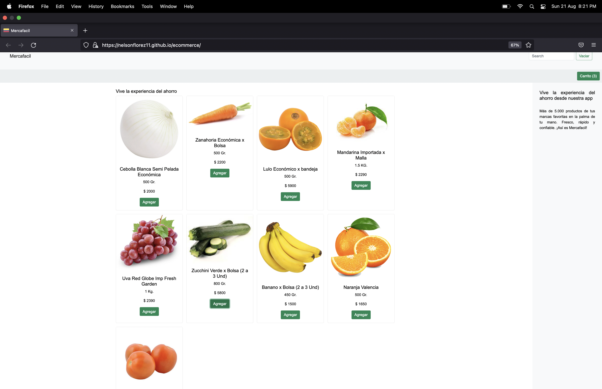

# Ecommerce

Proyecto final del curso JavaScript de la carrera Desarollo Full Stack en Coderhouse.

La temática del simulador es un Ecommerce de mercado.

https://nelsonflorez11.github.io/ecommerce/

A continuación los temas vistos en el programa

https://drive.google.com/file/d/13HzynwN1yZNb7QKqfNBgXvoo4hJSkyKT/view

